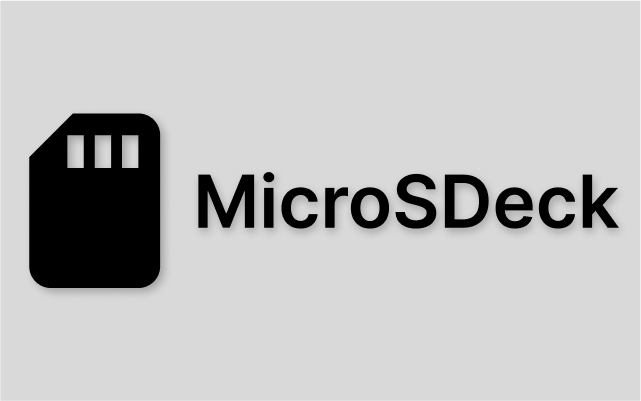

# MicroSDeck

**Manage your MicroSD cards and see which card each game is on**

MicroSDeck is a [Decky Loader](https://decky.xyz/) plugin for the Steam Deck that automatically tracks which games are installed on which MicroSD card. Swap cards with confidence: MicroSDeck detects insertions and removals in real time, names and organises your cards, and shows you at a glance — on every game's library page — exactly which card(s) it lives on.

[](./LICENSE)
[](https://www.npmjs.com/package/@cebbinghaus/microsdeck)

---

## Features

- **Automatic game detection** — Scans Steam's files to discover every game installed on a MicroSD card. No manual setup required for Steam games.
- **Real-time card monitoring** — Detects card insertions and removals
- **Library badges** — Steam library page shows badges indicating which MicroSD card(s) the game is on. Green means the card is currently inserted; dark means it's on another card.
- **Card management** — Name your cards (emoji supported 🎮📦), reorder them with drag-and-drop, hide cards you don't want to see, or delete cards you no longer own.
- **Non-Steam game support** — Manually associate non-Steam games (emulated ROMs, sideloaded apps, etc.) with a card through a searchable checklist.
- **Built-in documentation** — Interactive docs are embedded in the plugin with a guided quick-start checklist that tracks your progress using live plugin data.
- **Integration API** — The shared library is published as the [`@cebbinghaus/microsdeck`](https://www.npmjs.com/package/@cebbinghaus/microsdeck) NPM package, allowing other Decky plugins to query MicroSD card data.

---

## Installation

### From the Decky Plugin Store (Recommended)

1. Install [Decky Loader](https://decky.xyz/) on your Steam Deck.
2. Open the Quick Access menu (⋯ button) → Decky → Store (🛒).
3. Search for **MicroSDeck** and install it.

### Manual Installation

1. Download the latest release from [GitHub Releases](https://github.com/CEbbinghaus/MicroSDeck/releases).
2. Extract the contents to `~/homebrew/plugins/MicroSDeck` on your Steam Deck.
3. Restart Decky Loader.

---

## How It Works

MicroSDeck has a **Rust backend** and a **React/TypeScript frontend** connected by a REST + SSE API.

### Backend (Rust)

A statically-linked musl binary that runs as a background process managed by Decky Loader:

- **Card detection** — Reads the MicroSD card's unique hardware ID and resolves its mount point.
- **Game discovery** — Parses Steam's game files under the card's `steamapps/` directory to discover installed games.
- **Graph store** — Maintains an in-memory graph database (cards ↔ games) backed by a JSON file. Every mutation auto-persists.
- **Change detection** — Hashes game file metadata each polling cycle (default 5 seconds) and only re-syncs when something changes.
- **HTTP API** — An actix-web server exposes 28 REST endpoints plus an SSE `/listen` stream for real-time updates.

### Frontend (TypeScript/React)

A Decky Loader plugin UI that:

- **Quick Access panel** — Shows all known cards in a reorderable list. The currently inserted card is marked with a ⭐. Each card has a context menu to view games, edit, hide, or delete.
- **Library patch** — Hooks into Steam's library app detail page to inject MicroSD card badges onto every game's header.
- **Editing modal** — Rename cards, toggle visibility, and manage non-Steam game associations through a searchable checklist with visual diffs.
- **Docs viewer** — Sidebar-navigated documentation compiled from MDX at build time, including an interactive quick-start checklist.

### Shared Library (`@cebbinghaus/microsdeck`)

A TypeScript package providing:

- Type definitions for `MicroSDCard`, `Game`, `CardAndGames`, and `FrontendSettings`
- A stateless HTTP client with 13 fetch functions for the backend API
- The `MicroSDeck` class — a stateful singleton that caches data, auto-syncs via SSE, and exposes CRUD methods with an `EventTarget`-based event bus
- React hooks (`useCardsForGame`) and a context provider (`MicroSDeckContextProvider`) for easy integration

---

## Configuration

MicroSDeck stores its configuration in a TOML file on disk.

| Setting | Default | Description |
|---|---|---|
| `backend:port` | `12412` | HTTP API port |
| `backend:scan_interval` | `5000` | Milliseconds between card polling cycles |
| `backend:store_file` | `"store"` | Database filename (JSON) |
| `backend:log_file` | `"microsdeck.log"` | Log filename |
| `backend:log_level` | `"INFO"` | Log level (`TRACE`, `DEBUG`, `INFO`, `WARN`, `ERROR`) |
| `backend:startup:skip_validate` | `false` | Skip database validation on startup |
| `backend:startup:skip_clean` | `false` | Skip UID cleanup on startup |
| `frontend:dismissed_docs` | `false` | Whether the user dismissed the docs banner |

---

## Contributing

We welcome contributions of all kinds — bug fixes, features, documentation, and more. Please read our full [Contributing Guide](./CONTRIBUTING.md) and adhere to the [Code of Conduct](./CODE_OF_CONDUCT.md).

### Prerequisites

The project uses [Mise](https://mise.jdx.dev/) to manage tool versions. Install Mise and then run:

```sh
mise install
```

This installs the required versions of:

| Tool | Version |
|---|---|
| Node.js | 24.11.1 |
| pnpm | 10.22.0 |
| Rust | 1.91.0 (target: `x86_64-unknown-linux-musl`) |

Alternatively, install these tools manually at the versions specified in [`.mise.toml`](./.mise.toml).

### Building

The project provides a build script with multiple options:

```sh
# Build everything (backend + frontend + collect artifacts)
./build.sh

# Or use Mise tasks
mise run build

# Build only the backend
./build.sh -o backend

# Build only the frontend
./build.sh -o frontend

# See all options
./build.sh -h
```

Build artifacts are collected into the `build/` directory.

### Deploying to a Steam Deck

1. Copy `deploy.example.json` to `deploy.json` and fill in your Steam Deck's hostname, user, and SSH key path:
   ```json
   {
     "host": "steamdeck",
     "user": "deck",
     "keyfile": "~/.ssh/id_rsa"
   }
   ```

2. Upload with the build script:
   ```sh
   ./build.sh --upload
   # Or
   mise run upload
   ```

### Development Environment

A [Dev Container](https://containers.dev/) configuration is provided in `.devcontainer/` using the SteamDeckHomebrew holo-toolchain Docker image. This gives you the exact Rust cross-compilation environment used in CI.

### Project Conventions

- **Indentation** — Tabs (size 4) for TypeScript, JavaScript, Rust, and JSON
- **Line endings** — LF
- **Rust formatting** — Hard tabs (`rustfmt.toml`)
- **Version management** — The `version` file in the project root (symlinked to `backend/version`) is the single source of truth. The `util/versioning.mjs` script propagates it to all `package.json` files.

---

## License

MicroSDeck is licensed under the [GNU General Public License v2.0](./LICENSE).

---

## Credits

- **Creator** — [@CEbbinghaus](https://github.com/CEbbinghaus)
- **Contributors** — [@jeiza](https://github.com/jeiza), [@rainybyte](https://github.com/rainybyte)
- **Testing** — [@nabelo](https://github.com/nabelo)

